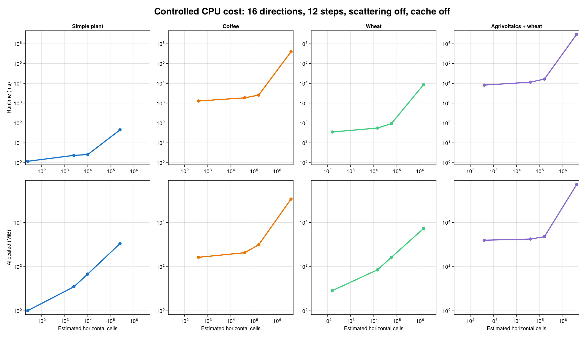
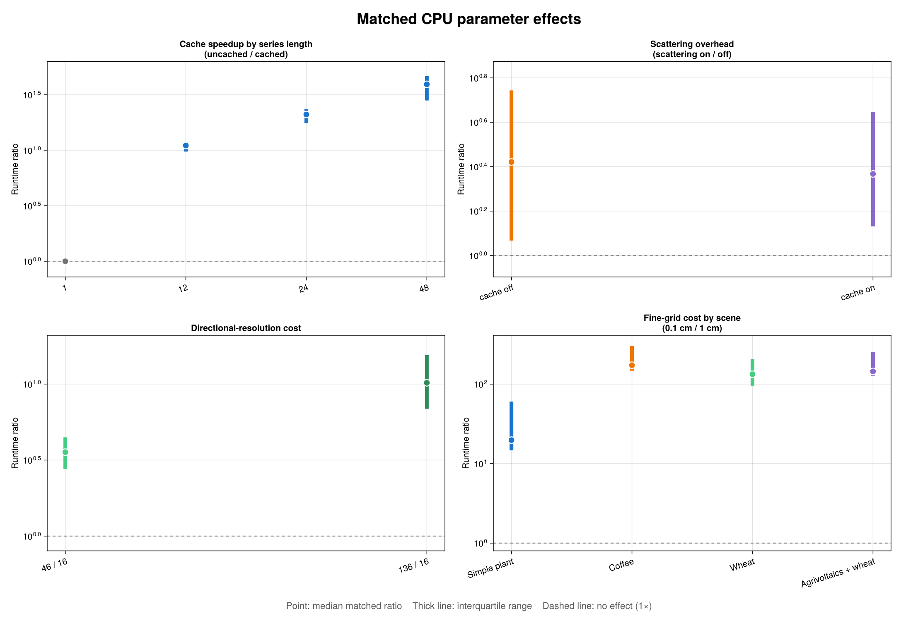

# CPU Performance Benchmarks

This page explains one recorded CPU benchmark matrix for the artifact scenes.
Its purpose is to show how numerical resolution, physical options, series
length, and scene geometry shape the cost of an ArchimedLight simulation. The
absolute timings belong to one machine and one run; the matched ratios are the
more useful part when planning a simulation.

```@contents
Pages = ["performance_benchmarks.md"]
Depth = 3
```

!!! warning "Exploratory results, not portable guarantees"
    The result file contains one timing sample per configuration and does not
    record the processor, operating system, Julia version, thread count, commit,
    run date, or warmup count. The current driver defaults to zero warmups, and
    cold compilation is visible in the first rows. Use the results to understand
    cost structure, not to predict wall-clock time on another machine.

## What Was Measured

The matrix uses the `normal_cpu` rasterization backend and varies:

| Parameter | Values |
| --- | --- |
| Scene | `simple_plant`, `coffee`, `wheat`, `agrivoltaics_wheat`, `elaeis`, `elaeis_two_plants` |
| Turtle directions | 16, 46, 136 |
| Pixel size | 0.1, 0.5, 1.0, 10.0 cm |
| Scattering | off, on |
| Radiation cache | off, on |
| Series length | 1, 12, 24, 48 steps |

For every sample, the benchmark constructs a fresh `LightSimulation` outside
the timer and times the call sequence that runs the requested sky series.
Scene-file loading is also outside the timer. Lazy validation, directional
projection, and radiation-cache preparation triggered by the first
`run_light` call remain inside the timed region. Consequently, a cached result
includes the cost of building its cache before measuring the benefit of reuse.

The planned matrix has 1,152 rows. The committed result currently contains 643:

| Scene | Recorded | Successful | Skipped as huge | Not recorded |
| --- | ---: | ---: | ---: | ---: |
| Simple plant | 192 | 156 | 36 | 0 |
| Coffee | 192 | 156 | 36 | 0 |
| Wheat | 192 | 156 | 36 | 0 |
| Agrivoltaics + wheat | 67 | 67 | 0 | 125 |
| Oil palm | 0 | 0 | 0 | 192 |
| Two oil palms | 0 | 0 | 0 | 192 |

The 108 `skipped_huge_case` rows are censored configurations, not fast
measurements and not solver failures. They are excluded from log-scale plots
and matched ratios. The agrivoltaics run stopped after all 16-direction cases
and three 46-direction cases, so comparisons are always paired on every other
parameter rather than averaged over the unbalanced matrix.

## Scene Geometry And Raster Resolution

The first figure uses a controlled slice: 16 directions, 12 steps, scattering
off, and radiation caching off. Both axes are logarithmic. Each point is one
measured pixel size; the upper row shows runtime and the lower row shows
cumulative Julia allocation.



The benchmark records a simple horizontal cell-count estimate from the scene
domain and `pixel_size`:

```math
N_\mathrm{cells} \approx
\left\lceil\frac{L_x}{\Delta x}\right\rceil
\times
\left\lceil\frac{L_y}{\Delta x}\right\rceil .
```

Each factor is one estimated horizontal grid dimension, so reducing the pixel
width by a factor of ten produces about 100 times as many estimated cells. This
is a consistent cross-case proxy, not the solver's exact internal raster size:
the solver derives its plot box from prepared bounds and its own rounding
rules. Mesh and hit-stack effects then add to the nominal spatial scaling.

| Scene | Nodes | Faces | Domain (m) | Estimated cells at 0.1 cm | Estimated cells at 1 cm | Representative runtime |
| --- | ---: | ---: | ---: | ---: | ---: | ---: |
| Simple plant | 4 | 68 | 0.5 × 0.5 | 250,000 | 2,500 | 0.328 ms |
| Wheat | 94 | 2,862 | 1.75 × 0.8163 | 1,429,750 | 14,350 | 5.279 ms |
| Coffee | 4,032 | 118,798 | 2 × 2 | 4,000,000 | 40,000 | 164.873 ms |
| Agrivoltaics + wheat | 22,373 | 681,158 | 0.4 × 10 | 4,000,000 | 40,000 | 1,018.62 ms |

The representative runtime fixes 16 directions, 1 cm pixels, one step,
scattering off, and cache off. Coffee and agrivoltaics have the same domain
area and the same 1 cm raster-cell estimate, yet agrivoltaics has 5.73 times
more faces and is 6.18 times slower. Raster-cell count is therefore not a
complete complexity measure: mesh traversal, the number and density of
projected faces, hit-stack construction, and memory locality also matter.

Across matched configurations, changing from 1 cm to 0.1 cm pixels costs a
median 19.7× for the tiny simple plant, 133.2× for wheat, 173.1× for coffee,
and 144.7× for agrivoltaics. Complex scenes can therefore scale more steeply
than the nominal 100× increase in grid cells. At coarse resolution the reverse
also matters: fixed face-processing and per-direction work form a floor, so
making pixels still larger eventually yields diminishing savings.

See [`pixel_size`](reference_config.md#pixel_size) and
[First-Order Interception](theory_interception.md) for the numerical meaning of
the projection grid.

## Matched Parameter Effects

The next figure compares configurations that differ in exactly one parameter.
The point is the median matched ratio and the thick line is the interquartile
range across configurations. It is not a repeated-run confidence interval.
A ratio above one means that the numerator is slower.



| Effect | Comparison | Median ratio | Interquartile range | Pairs |
| --- | --- | ---: | ---: | ---: |
| Cache speedup | 1 step, uncached / cached | 1.000× | 0.974–1.029× | 80 |
| Cache speedup | 12 steps, uncached / cached | 11.036× | 9.744–11.875× | 56 |
| Cache speedup | 24 steps, uncached / cached | 21.007× | 17.596–23.465× | 56 |
| Cache speedup | 48 steps, uncached / cached | 39.296× | 28.101–46.725× | 56 |
| Scattering overhead | cache off, on / off | 2.638× | 1.167–5.542× | 124 |
| Scattering overhead | cache on, on / off | 2.330× | 1.352–4.431× | 124 |
| Direction cost | 46 / 16 | 3.565× | 2.771–4.465× | 195 |
| Direction cost | 136 / 16 | 10.193× | 6.884–15.501× | 84 |

### Series Length And `cache_radiation`

Without radiation caching, median runtime scales almost linearly with the
number of steps: 12, 24, and 48 steps cost 11.56×, 22.98×, and 45.54× the
matched one-step runtime. With caching, total runtime grows by only 1.037×,
1.081×, and 1.161× over the same series lengths. The expensive fixed
directional response is built once and subsequent sky states mainly reweight
that response.

This is why caching is neutral for one step but decisive for a fixed scene
used over a long meteo series. It also reduces cumulative allocation: the
uncached/cached allocation ratios are 9.99×, 17.20×, and 27.49× at 12, 24, and
48 steps.

!!! note "Cumulative allocation is not peak memory"
    `median_alloc_mb` is the number of bytes allocated during the timed call,
    not resident set size or peak RAM. A radiation cache retains directional
    responses, so lower cumulative allocation does not mean the cache itself
    occupies no memory.

Caching is appropriate only while the scene geometry, models, and relevant
options remain unchanged. Call `update_scene!(sim, new_scene)` when geometry
changes so stale directional responses are not reused. See
[`cache_radiation`](reference_config.md#cache_radiation) for the cache model.

### Directional Resolution

Moving from 16 to 46 directions increases the sector count by 2.875× and
runtime by a median 3.565×. Moving from 16 to 136 directions increases the
sector count by 8.5× and runtime by a median 10.193×. The result is close to,
but moderately steeper than, linear directional scaling. Direction-specific
projection, allocation, and scattering topology add overhead beyond simply
looping over more sectors.

Direction count controls angular resolution, not scene or atmospheric
physics. Treat it as a convergence parameter: compare outputs at successive
canonical turtle sizes rather than selecting 16 directions solely because it
is cheaper. See [`sky_sectors`](reference_config.md#sky_sectors).

### Scattering

Scattering adds a median factor of 2.64 without radiation caching and 2.33
with caching. It requires richer hit information and iteratively transfers
intercepted light between surfaces. Dense canopies, reflective optical
properties, and stricter convergence settings can move a case well above the
median.

Unlike caching, scattering is not merely an implementation choice. Disabling
it removes a physical redistribution process, especially important in dense
canopies and in NIR. Use first-order-only runs for screening or when the
scientific question genuinely permits that approximation, not simply to
obtain a faster number. See [`scattering`](reference_config.md#scattering) and
[Scattering And Assumptions](theory_scattering.md).

## Practical Guidance

1. **Simplify unnecessary tessellation before tuning solver parameters.**
   Coffee and agrivoltaics show that equal projected domains can have very
   different costs when face counts differ.
2. **Run a spatial convergence study.** Start with a coarse pilot grid, then
   reduce `pixel_size` until the quantities relevant to your analysis stabilize.
   A tenfold refinement can cost roughly 20× to more than 170× in this dataset.
3. **Treat turtle directions the same way.** Sixteen directions are useful for
   screening, 46 provide an intermediate check, and 136 should be reserved for
   cases whose angular convergence requires it.
4. **Enable `cache_radiation` for multi-step simulations with fixed geometry.**
   It does little for a single step but amortizes almost all repeated
   directional work in the longer series measured here.
5. **Choose scattering from the physics.** Its roughly 2–3× median overhead is
   a resource-planning number, not a reason to omit it from a model that needs
   multiple scattering.
6. **Avoid combining every expensive setting blindly.** Fine pixels, many
   directions, scattering, a dense mesh, and a long uncached series multiply
   rather than replace one another.

## Limitations And Timing Artifacts

- Only three scenes have complete parameter coverage. Agrivoltaics is partial,
  and neither oil-palm scene has recorded rows.
- Each successful row has `samples = 1`, so minimum, median, and maximum are
  identical and measurement uncertainty cannot be estimated.
- The first fine-grid simple-plant timing is cold-compilation contaminated:
  one uncached step takes 2,136.85 ms while its 12-step counterpart takes only
  45.11 ms.
- One coffee configuration was evidently interrupted or suspended: 46
  directions, 0.5 cm pixels, scattering on, cache off, and 48 steps took
  25,463,078 ms (7.07 hours), while its 24-step counterpart took 147,016 ms
  and allocation scaled normally. Robust medians limit its influence, but the
  raw row is retained.
- Step counts use separately sampled sky series. They are not repetitions of
  one identical sky state.
- Skipped huge cases are censored data and are never interpreted as completed
  timings.

These limitations make the current matrix an exploratory performance
landscape. A future publication-quality run should record hardware, software
and commit provenance, warm up every code path, use repeated samples, randomize
case order, and complete all scenes.

## Reproduce The Figures And Tables

The plotting script uses only Base Julia for TSV parsing and CairoMakie for
figures:

```bash
julia --project=benchmark benchmark/visualize_artifact_scene_matrix.jl
```

It reads `benchmark/results/artifact_scene_matrix_cpu.tsv` and writes:

- `docs/src/assets/benchmark_scene_matrix_overview.png`
- `docs/src/assets/benchmark_scene_matrix_effects.png`
- `benchmark/results/artifact_scene_matrix_summary.md`

The documentation build embeds the committed images and does not rerun the
matrix or download its lazy scene artifact. The
[raw CPU results](https://github.com/VEZY/ArchimedLight.jl/blob/main/benchmark/results/artifact_scene_matrix_cpu.tsv)
remain available for alternative analyses.
