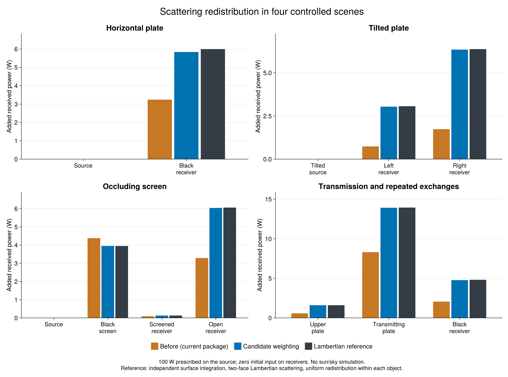

# Scattering comparison and validation route

For the documentation's **current algorithm versus Lambertian reference** view,
use `evaluate_current.jl` and its `ScatteringCurrentEvaluation.run()` entry point.
It evaluates the loaded corrected package directly and writes `results-current.json`;
`python3 scripts/build_evaluation_asset.py` exports those two outputs to the docs.
The report and three-way results below retain the earlier `gpu` snapshot for provenance.

Computed 2026-09-29 in a Kaimon-managed Julia 1.13.1 session, using ArchimedLight
`gpu` at `384a90d`. The production source has not been modified by this comparison.
The previous local correction was absent from the checkout when this work began.

## What the three outputs mean

- **Before:** actual directional projections and unweighted scattering counts from the current package.
  The reconstructed matrix is checked against the package's iterative scattering propagator to within 1e-8 W.
- **Corrected candidate:** exactly the same projections, with each direction's pair counts and full source
  hit totals multiplied by `abs(s_z) * sector.weight` before normalization. Escape remains in the denominator.
  This is a candidate calculation in the validation harness, not a claim that all production backends are patched.
- **Lambertian reference:** an independent double surface integral over rectangles, with explicit segment
  visibility. It uses neither the package raster nor its direction grid. Repeated exchanges are solved as a
  linear system. Uniform redistribution within each object and equal emission from both faces are retained.

All scenes prescribe **100 W initially intercepted by object 1 and zero on every other object**.
This isolates redistribution; it does not simulate an outdoor sky, lamp beam, or the initial shadow pattern.
The screen blocks subsequent source-to-receiver paths. Lengths are metres and the outputs are powers in watts.
Irradiance in W/m² is also exported in `object_outputs.csv` by dividing by geometric object area.

## Scenes

1. **Horizontal plate:** two equal 1 m squares, 1 m apart; source scattering coefficient 0.6,
   black receiver. The analytical received power is **5.99474687095 W**.
2. **Tilted plate:** a 45 degree source and two black receivers to distinguish angular redistribution.
3. **Occluding screen:** a black vertical screen partly hides one receiver while another stays unobstructed.
4. **Transmission and repeated exchanges:** upper and middle plates scatter 0.7 and 0.8 of intercepted power.
   The retained model splits these into `(reflection, transmission) = (0.35, 0.35)` and `(0.4, 0.4)`.
   A lower black plate collects light, including light transmitted diffusely through the middle plate.

The `transparency` parameter is held at zero. Its existing straight-through interception semantics are a
separate issue and are not used as a physical beam-transmission coefficient in these experiments.

## Main comparison

The 3D comparison and plots use **2304 equal-solid-angle directions**, **10 mm pixels**,
and **96 × 96 surface samples per rectangle** for the independent reference. Both before and candidate use
the same direction grid, raster, geometry, material coefficients, and initial power.

Maximum absolute error across objects, against the independent reference:

| Scene | Before (W) | Candidate (W) | Error reduction | Reference change, 48→96 subdivisions (W) |
|---|---:|---:|---:|---:|
| Horizontal plate | 2.7522 | 0.1571 | 94.3% | 0.00059 |
| Tilted plate | 4.6353 | 0.0273 | 99.4% | 0.00058 |
| Occluding screen | 2.7722 | 0.0205 | 99.3% | 0.00069 |
| Transmission and repeated exchanges | 5.6332 | 0.0430 | 99.2% | 0.00206 |

For the horizontal receiver specifically: **3.2427 W before →
5.8379 W candidate**, versus **5.9949 W** in the surface-integral reference.
The candidate's remaining error there is about **2.62% of receiver power**.



`comparison.pdf` is the vector export. `results.json` contains geometry, optics, all object powers,
escaped power and numerical diagnostics; `object_outputs.csv` contains the per-object numerical outputs.

## Resolution checks and limits

The correction improves every tested scene, but the numerical results are not fully converged.
The built-in turtle grids do not approach the continuum monotonically in these examples. The equal-solid-angle
grid helps isolate weighting from angular sampling, but finite pixel alignment and angular quadrature still matter.
The 46-direction run also uses larger pixels, so that column is not a pure angular refinement experiment.

| Scene | Turtle 46, 30 mm: error W | Turtle 406, 10 mm: error W | Equal-area 1024, 10 mm: error W | Equal-area 2304, 10 mm: error W | Pixel-only change, 20→10 mm at 1024 directions W |
|---|---:|---:|---:|---:|---:|
| Horizontal plate | 0.0353 | 0.3529 | 0.1145 | 0.1571 | 0.1620 |
| Tilted plate | 0.5175 | 0.2199 | 0.0389 | 0.0273 | 0.0433 |
| Occluding screen | 0.8670 | 0.3932 | 0.0424 | 0.0205 | 0.0181 |
| Transmission and repeated exchanges | 0.7917 | 0.4569 | 0.0481 | 0.0430 | 0.0444 |

Reference-refinement differences are empirical sensitivity estimates, not certified error bounds.
An additional Kaimon diagnostic confirmed a raster-alignment effect in the horizontal case: at nominal
10 mm pixels, the ground receiver occupies 10,000 pixels with the 1024-direction padded bounds but
9,801 pixels with the wider 2304-direction bounds. The exact same-direction overlap calculation predicts
5.938009282 W for the latter grid, versus 5.837879955 W from the candidate raster and 5.994746871 W
in the continuum. Thus angular sampling and raster coverage both contribute to the residual.
See `raster-phase-check.json` and `raster_phase.jl`. This diagnostic does not patch the raster algorithm.

For repeated exchanges, this checks the retained object-uniform approximation; a surface-resolved radiosity
or Monte Carlo solution would additionally test whether redistributing each object's energy uniformly is adequate.

All **157 executable checks passed** on the final stored outputs. They cover the analytical parallel-square view factor, area reciprocity, screen visibility,
an exact two-object geometric series, nonnegative absorption/escape, and package-propagator agreement.
Absorbed plus escaped power equals the prescribed input. The sum of cumulative received powers is **not**
an energy conservation test because the same energy can be received repeatedly.

## How to validate the model physically

1. Retain these independent numerical checks and add them to regression testing when integrating the candidate
   into production. Verify CPU/GPU, cached/streamed execution and multiple spectral bands separately.
2. Refine directions, pixels, raster origin and object subdivision until each receiver's result is stable relative
   to the experimental uncertainty. Do not treat a conserved energy budget as proof of a correct distribution.
3. Start with the [NREL vertical testbed](https://data.nlr.gov/submissions/254) for measured daylight,
   known plate geometry and local irradiance. Compare first-order interception and shadows first.
4. Before validating rediffusion, represent or bound the measured material reflection/transmission separately.
   An opaque reflector cannot be represented faithfully by the present equal diffuse reflection/transmission split.
   Then compare total received irradiance at held-out sensor positions and times; keep optical inputs independent
   of the measurements being used to judge model accuracy.
5. Use the new transmitting-PV and forest candidates in [DATASETS.md](DATASETS.md) when their geometry,
   sensor mapping, sky forcing and material compatibility are adequate. None supplies independently measured
   scattering orders or per-object absorbed energy. A simulation with scattering disabled is an attribution
   experiment, not independent empirical proof of the scattered component.

## Reproduce

Start or connect an ArchimedLight test-project session through Kaimon, then run:

```julia
include("/Users/rvezy/Documents/dev/ArchimedLight/validation/scattering_comparison/run.jl")
ScatteringComparison.run(equal_area_rings=24, pixel=0.01, ref_subdivisions=96)
include("/Users/rvezy/Documents/dev/ArchimedLight/validation/scattering_comparison/checks.jl")
ScatteringComparisonChecks.run_checks()
include("/Users/rvezy/Documents/dev/ArchimedLight/validation/scattering_comparison/plots.jl")
ScatteringComparisonPlots.plot_comparison()
```

Additional stored runs are `run(sectors=46, pixel=.03, ref_subdivisions=24)`,
`run(sectors=406, pixel=.01, ref_subdivisions=48)`, and
`run(equal_area_rings=16, pixel=.01, ref_subdivisions=48)`; preserve `results.json` under their respective
filenames before the next run. `resolution.jl` provides the 1024-direction, 20 mm pixel-only comparison.
Finally run `python3 validation/scattering_comparison/write_report.py` to rebuild this report and CSV.

Analytical reference: [Salazar et al., NASA CHAR verification, Eq. 71](https://ntrs.nasa.gov/citations/20160006076).
